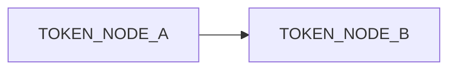

# Architecture Overview

## Purpose
- Summarize the architecture intent, constraints, and major components.

## Scope
- Systems covered: TOKEN_SYSTEMS
- Environments: TOKEN_ENVIRONMENTS

## High-Level Diagram

## Components
- TOKEN_COMPONENTS

## Data Flows
- TOKEN_DATA_FLOWS

## Security and Residency
- Region default: ca-central-1 unless contractually overridden.
- Tenant isolation: TOKEN_TENANT_ISOLATION

## Dependencies
- Upstream: TOKEN_UPSTREAM
- Downstream: TOKEN_DOWNSTREAM

## References
- MCP Evidence IDs: TOKEN_EVIDENCE_IDS
- Related ADRs: TOKEN_ADR_IDS

## Acceptance Criteria
- Diagram aligns with described components and flows.
- Security and residency constraints documented.
