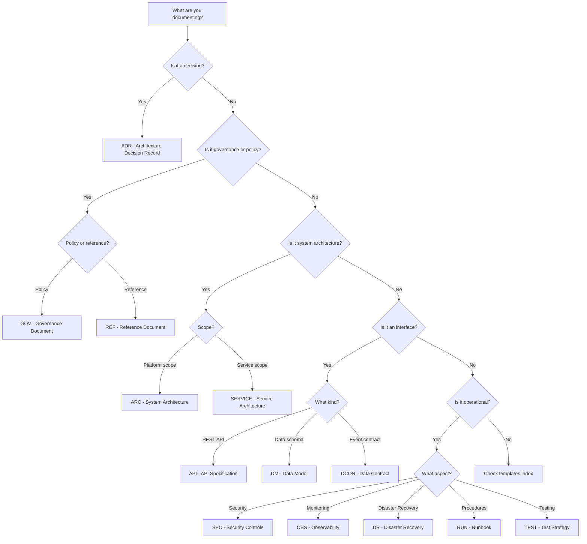

# Document Type Selection Guide (CloudRail)

This guide helps choose the correct document type and ensures CloudRail governance rules are met.

## Decision Tree

## CloudRail Document Families and Paths
- System architecture: `docs/02_ARCHITECTURE/ARC-*.md`
- Data models: `docs/03_CONTRACTS/DM-*.md`
- Contract registry: `docs/03_CONTRACTS/REGISTRY.md`
- Services: `docs/04_SERVICES/SERVICE_*.md`
- Workflows: `docs/05_WORKFLOWS/WORKFLOW_*.md`
- Runner contract: `docs/05_WORKFLOWS/RUNNER_CONTRACT.md`
- Operations: `docs/07_OPERATIONS/*.md`
- Governance index: `docs/09_GOVERNANCE/GOV-ARCH-001-Architecture-Documentation-Index.md`

## Mandatory Rules for CloudRail
- DM documents must reference schemas under `contracts/schemas/` and examples under `contracts/examples/`.
- If schemas or examples are missing and not created in the same patch, stop with `BLOCKER` and list required files.
- When adding ADR, ARC, DM, SERVICE, or WORKFLOW docs, update GOV-ARCH-001 in the same patch (same strength requirement). This includes ADR additions explicitly. **MANDATORY**: Adding any ADR requires GOV-ARCH-001 update in the same patch without exception.
- Canada-first defaults: `ca-central-1` unless a contract explicitly allows another region.
- Normative claims must follow `references/mcp-validation.md` and log entries in `MCP_EVIDENCE_LOG.md`.
- Templates may use TOKEN_* markers; published docs must replace all tokens.

## Build Order Mapping

| Sequence Block | Doc Category | Path Pattern | Template(s) | Governing Gates |
|----------------|--------------|--------------|-------------|-----------------|
| A | System Architecture | `docs/02_ARCHITECTURE/ARC-*.md` | `templates/architecture-overview.md` | System boundaries, Control/Tenant plane separation |
| A | Business Requirements | `docs/01_REQUIREMENTS/*.md` | Requirement templates (if present) | Stakeholder approval, Geographic region defined |
| B | Architecture Decisions | `docs/09_GOVERNANCE/ADR-*.md` | `templates/adr.md` | MCP evidence, Technical review complete |
| B | Technical Specifications | `docs/02_ARCHITECTURE/TECH-*.md` | Architecture templates | Technology stack finalized, Integration patterns defined |
| C | Data Models | `docs/03_CONTRACTS/DM-*.md` | `templates/contract-data.md` | Schemas exist, Examples validate |
| C | JSON Schemas | `contracts/schemas/*.schema.json` | Schema templates | Schema validation passes |
| C | Schema Examples | `contracts/examples/**` | Example templates | Examples validate against schemas |
| C | API Contracts | `docs/03_CONTRACTS/API-*.md` | API templates | Interface specifications approved |
| D | Services | `docs/04_SERVICES/SERVICE_*.md` | `templates/service-spec.md` | Service contracts finalized, Ownership assigned |
| E | Workflows | `docs/05_WORKFLOWS/WORKFLOW_*.md` | `templates/workflow-spec.md` | Service dependencies identified |
| E | Runner Contracts | `docs/05_WORKFLOWS/RUNNER_CONTRACT.md` | `templates/runner-contract.md` | Tenant isolation requirements defined |
| F | Datastores | `docs/06_DATASTORES/*.md` | Datastore templates (if present) | Data model approved, Storage requirements finalized |
| G | Security Controls | `docs/06_SECURITY/*.md` | Security templates | Security requirements finalized |
| G | Operations | `docs/07_OPERATIONS/*.md` | Operations templates | Operational readiness criteria defined |
| G | Implementation | `docs/08_IMPLEMENTATION/*.md` | Implementation templates | All preceding blocks complete |

## Phase-to-Document Inventory

| Phase | Document Categories | Target Paths | Templates | Required When |
|--------|-------------------|---------------|------------|---------------|
| P0 | Governance intake | `docs/09_GOVERNANCE/GOV-ARCH-001-Architecture-Documentation-Index.md` | governance templates | Always (first phase) |
| P1 | Requirements analysis | Internal documentation | None | Always |
| P2 | Architecture & Data Models | `docs/02_ARCHITECTURE/ARC-*.md` `docs/03_CONTRACTS/DM-*.md` `docs/03_CONTRACTS/REGISTRY.md` `contracts/schemas/*.schema.json` `contracts/examples/**` | `templates/architecture-overview.md` `templates/adr.md` `templates/contract-data.md` `templates/contract-registry.md` | When designing systems or data |
| P3 | Services & Workflows | `docs/04_SERVICES/SERVICE_*.md` `docs/05_WORKFLOWS/WORKFLOW_*.md` `docs/05_WORKFLOWS/RUNNER_CONTRACT.md` | `templates/service-spec.md` `templates/workflow-spec.md` `templates/runner-contract.md` | When defining services or orchestration |
| P4 | Security & Operations | `docs/07_OPERATIONS/*.md` (SEC, OBS, DR, RUN, TEST) | `templates/common-header.md` Template-specific by type | Always |
| P5 | Documentation Quality | Internal artifacts only | `templates/mcp-evidence-log.md` `templates/well-architected-pillar-matrix.md` `templates/phase-completion-report.md` | Always |
| P6 | Publication & Integration | Updates to existing docs | `templates/phase-completion-report.md` | Always (final phase) |

## Build Order Enforcement Rule

**Greenfield builds MUST follow references/doc-build-sequence.md; deviations require WAIVER in PHASE_COMPLETION_REPORT_PN.md.**

## Critical Update Requirements

### GOV-ARCH-001 Updates (MANDATORY)
- When ANY ADR is added → update GOV-ARCH-001 in same patch
- When ANY ARC doc is added → update GOV-ARCH-001 in same patch  
- When ANY DM doc is added → update GOV-ARCH-001 in same patch
- When ANY SERVICE doc is added → update GOV-ARCH-001 in same patch
- When ANY WORKFLOW doc is added → update GOV-ARCH-001 in same patch

### MCP Evidence Timing
- Pre-flight: Execute before drafting normative claims (see `references/mcp-validation.md`)
- Post-flight: Execute after completing drafts but before phase completion
- All evidence must be logged in `MCP_EVIDENCE_LOG.md` with format `MCP-YYYYMMDD-NNNN`

## MCP Mapping
- Authoritative mapping and tool names live in `references/mcp-validation.md`. Use that for preflight/postflight requirements per doc type.
