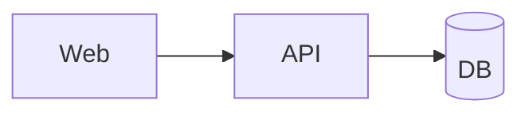

# C4 Container View

## Purpose
- Detail containers/services, responsibilities, and interfaces.

## Scope
- System: TOKEN_SYSTEM

## Diagram

## Containers
- TOKEN_CONTAINER: purpose, technology, interfaces

## Interfaces
- API endpoints/events/contracts: TOKEN_INTERFACES

## Deployment
- Region: ca-central-1 default unless overridden.
- Network tiers and security groups: TOKEN_NETWORK

## References
- MCP Evidence IDs: TOKEN_EVIDENCE_IDS
- Related ADRs: TOKEN_ADR_IDS

## Acceptance Criteria
- All containers have responsibilities and interfaces.
- Security boundaries and network placement stated.
