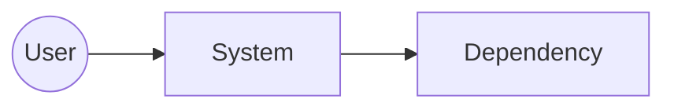

# C4 Context View

## Purpose
- Show system in its environment: users, external systems, and high-level dependencies.

## Scope
- System: TOKEN_SYSTEM
- Primary users: TOKEN_USERS

## Diagram

## Relationships
- Users interact via TOKEN_CHANNELS
- External dependencies: TOKEN_DEPENDENCIES

## Security/Residency Notes
- Region default ca-central-1 unless contractually overridden.
- Tenant isolation via AssumeRole with external ID.

## References
- MCP Evidence IDs: TOKEN_EVIDENCE_IDS
- Related ADRs: TOKEN_ADR_IDS

## Acceptance Criteria
- All external actors and systems are represented.
- Trust boundaries are labeled and justified.
