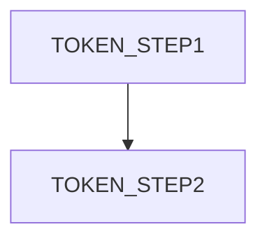

# Workflow Specification

## Purpose
- Define orchestration, steps, and error handling for a workflow.

## Scope
- Workflow: TOKEN_WORKFLOW
- Trigger: TOKEN_TRIGGER

## Diagram

## Steps
| Step | Description | Inputs | Outputs | Owner |
|------|-------------|--------|---------|-------|
| TOKEN_STEP | TOKEN_DESC | TOKEN_INPUTS | TOKEN_OUTPUTS | TOKEN_OWNER |

## Error Handling
- Retries/timeouts: TOKEN_RETRIES
- DLQ/parking: TOKEN_DLQ

## Security
- Roles/permissions: TOKEN_ROLES
- Region default ca-central-1; tenant isolation enforced.

## References
- MCP Evidence IDs: TOKEN_EVIDENCE_IDS
- Related ADRs: TOKEN_ADR_IDS

## Acceptance Criteria
- Steps are deterministic and idempotent where required.
- Failure modes and compensations documented.
